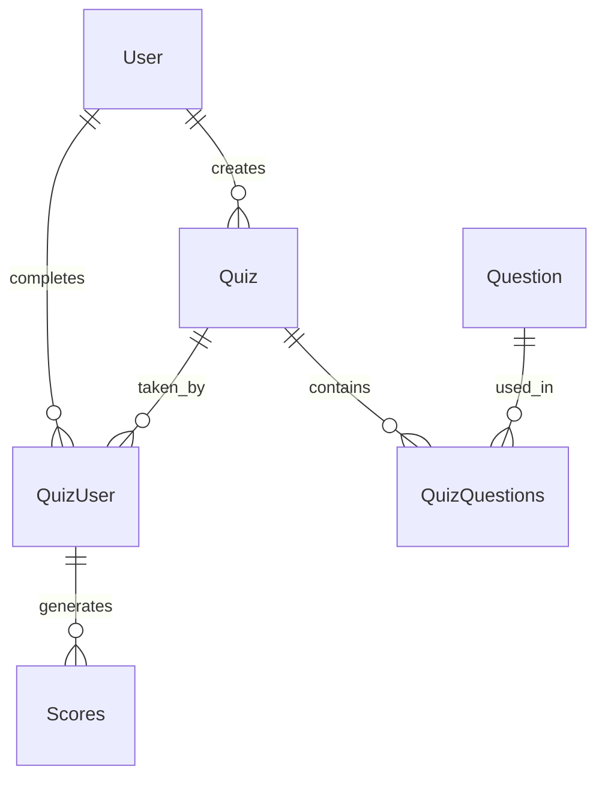

# Decision Helper App: System Design Document

## Architecture Overview

Decision Helper App follows the MVVM (Model-View-ViewModel) architecture pattern to ensure a clear separation of concerns, modularity, and ease of maintenance. The application integrates with Firebase services for authentication, data storage, and file management.

```
┌─────────────┐     ┌───────────────┐     ┌────────────────┐     ┌─────────────┐
│     View    │◄────│   ViewModel   │◄────│   Repository   │◄────│    Model    │
│  Activities │     │ LiveData/Obs. │     │ Data Access/   │     │  Entities   │
│  Fragments  │────►│ Event Handlers│────►│ Business Logic │────►│   & DAOs    │
└─────────────┘     └───────────────┘     └────────────────┘     └─────────────┘
```

## 1. Model Layer

The Model layer represents domain data and business logic.

### 1.1 Data Models

#### 1.1.1 User.java
- **Responsibility**: Represents user information and authentication state
- **Properties**:
  - `id`: String - Unique identifier (Firebase UID)
  - `email`: String - User's email address
  - `name`: String - User's display name
  - `username`: String - Optional username
  - `passwordHash`: String - Hashed password (for email authentication)
  - `profilePictureUrl`: String - URL to profile image
  - `viaGmail`: boolean - Whether user authenticated via Google
  - `creationDate`: Date - Account creation timestamp
  - `lastLoginDate`: Date - Most recent login timestamp
  - `lastUpdated`: Date - Profile last update timestamp

#### 1.1.2 Quiz.java
- **Responsibility**: Represents a decision quiz/questionnaire
- **Properties**:
  - `id`: String - Unique identifier
  - `customTitle`: String - Quiz title
  - `description`: String - Quiz description
  - `userId`: String - Creator's user ID
  - `score`: int - Score value (if applicable)
  - `completedAt`: String - Completion timestamp
  - `isPublic`: boolean - Public availability flag

#### 1.1.3 Question.java
- **Responsibility**: Represents individual questions within quizzes
- **Properties**:
  - `id`: String - Unique identifier
  - `title`: String - Question text
  - `type`: String - Question type (multiple_choice, yes_no_question)
  - `description`: String - Storage for answer options encoded as text
  - `imageUrl`: String - Optional image URL
  - `answers`: List<Answer> - Collection of answer options
- **Inner Classes**:
  - `Answer`: Represents a possible answer with text and percentage weight

#### 1.1.4 QuizQuestions.java
- **Responsibility**: Maps relationship between quizzes and questions
- **Properties**:
  - `id`: String - Unique identifier
  - `quizId`: String - Associated quiz ID
  - `questionId`: String - Associated question ID
  - `order`: int - Question sequence number

#### 1.1.5 QuizUser.java
- **Responsibility**: Tracks users' interactions with quizzes
- **Properties**:
  - `id`: String - Unique identifier
  - `quizId`: String - Associated quiz ID
  - `userId`: String - User ID
  - `completed`: boolean - Completion status
  - `score`: int - User's score
  - `takenAt`: Date - Timestamp

#### 1.1.6 Scores.java
- **Responsibility**: Records quiz scores and interpretations
- **Properties**:
  - `id`: String - Unique identifier
  - `quizId`: String - Associated quiz ID
  - `userId`: String - User ID
  - `score`: int - Numeric score
  - `interpretation`: String - Result interpretation based on score range

### 1.2 Data Access Objects (DAOs)

#### 1.2.1 UserDAO.java
- **Responsibility**: Manages user data in Firebase Firestore
- **Key Methods**:
  - `getAllUsers(UserCallback)`: Retrieves all users
  - `getUserById(String, SingleUserCallback)`: Fetches user by ID
  - `getUserByEmail(String, SingleUserCallback)`: Fetches user by email
  - `addUser(User, ActionCallback)`: Creates new user record
  - `updateUser(User, ActionCallback)`: Updates existing user
  - `deleteUser(String, ActionCallback)`: Removes user record

#### 1.2.2 QuizDAO.java
- **Responsibility**: Manages quiz data in Firebase Firestore
- **Key Methods**:
  - `getAllQuizzes(QuizCallback)`: Retrieves all quizzes
  - `getQuizById(String, SingleQuizCallback)`: Fetches quiz by ID
  - `addQuiz(Quiz, ActionCallback)`: Creates new quiz
  - `updateQuiz(Quiz, ActionCallback)`: Updates existing quiz
  - `deleteQuiz(String, ActionCallback)`: Removes quiz

#### 1.2.3 QuestionDAO.java
- **Responsibility**: Manages question data in Firebase Firestore
- **Key Methods**:
  - `getAllQuestions(QuestionCallback)`: Retrieves all questions
  - `getQuestionById(String, SingleQuestionCallback)`: Fetches question by ID
  - `addQuestion(Question, ActionCallback)`: Creates new question
  - `updateQuestion(Question, ActionCallback)`: Updates existing question
  - `deleteQuestion(String, ActionCallback)`: Removes question

#### 1.2.4 QuizQuestionsDAO.java
- **Responsibility**: Manages quiz-question relationships
- **Key Methods**:
  - `getQuestionsForQuiz(String, QuestionsCallback)`: Gets questions for specific quiz
  - `addQuizQuestion(QuizQuestions, String, ActionCallback)`: Links question to quiz

#### 1.2.5 QuizUserDAO.java
- **Responsibility**: Manages user-quiz interaction records
- **Key Methods**:
  - `getAllQuizUsers(QuizUserCallback)`: Gets all quiz-user records
  - `getQuizUsersByQuizId(String, QuizUserCallback)`: Gets users for specific quiz
  - `getQuizUsersByUserId(String, QuizUserCallback)`: Gets quizzes for specific user
  - `getQuizzesForUser(String, QuizCallback)`: Gets quiz objects for user
  - `addQuizUser(QuizUser, ActionCallback)`: Creates new quiz-user record
  - `updateQuizUser(QuizUser, ActionCallback)`: Updates existing record
  - `deleteQuizUser(String, ActionCallback)`: Removes record

#### 1.2.6 ScoresDAO.java
- **Responsibility**: Manages score data
- **Key Methods**:
  - `getAllScores(ScoresCallback)`: Retrieves all scores
  - `getScoresByQuizId(String, ScoresCallback)`: Gets scores for specific quiz
  - `getScoresByUserId(String, ScoresCallback)`: Gets scores for specific user
  - `addScore(Scores, ActionCallback)`: Creates new score record
  - `updateScore(Scores, ActionCallback)`: Updates existing score
  - `deleteScore(String, ActionCallback)`: Removes score

### 1.3 Repository

#### 1.3.1 DecisionRepository.java
- **Responsibility**: Centralizes data operations from all DAOs
- **Properties**:
  - Instances of all DAO classes
- **Methods**:
  - Delegate methods for each DAO operation
  - Coordinates cross-entity operations
- **Implementation Details**:
  - Initializes Firebase connections
  - Manages asynchronous callbacks
  - Serves as single access point for all data operations

## 2. View Layer

The View layer contains UI components and user interaction handlers.

### 2.1 Activities

#### 2.1.1 BaseActivity.java
- **Responsibility**: Parent class for common activity functionality
- **Key Methods**:
  - `onCreate()`: Sets up common components like toolbar
  - `onCreateOptionsMenu()`: Sets up menu options
  - `onOptionsItemSelected()`: Handles menu interactions

#### 2.1.2 SplashActivity.java
- **Responsibility**: Application entry point and authentication check
- **Key Methods**:
  - `onCreate()`: Checks authentication state and redirects accordingly

#### 2.1.3 LoginActivity.java
- **Responsibility**: Handles user authentication
- **Key Methods**:
  - `onCreate()`: Sets up login UI and click listeners
  - `observeViewModel()`: Observes authentication state changes
  - `showRegistrationDialog()`: Displays registration form dialog

#### 2.1.4 MainActivity.java
- **Responsibility**: Primary navigation hub
- **Key Methods**:
  - `onCreate()`: Sets up main UI and navigation buttons
  - `navigateToLogin()`: Handles redirection to login
  - `updateUIWithUser()`: Updates UI with user information

#### 2.1.5 CreateQuizActivity.java
- **Responsibility**: Quiz creation interface
- **Key Methods**:
  - Form handling for quiz creation
  - Question management interface
  - Image upload functionality

#### 2.1.6 QuizActivity.java
- **Responsibility**: Quiz listing and management
- **Key Methods**:
  - Display available quizzes
  - Quiz filtering and sorting

#### 2.1.7 TakeQuizActivity.java
- **Responsibility**: Quiz answering interface
- **Key Methods**:
  - Question display and navigation
  - Answer selection handling
  - Progress tracking

#### 2.1.8 ScoresActivity.java
- **Responsibility**: Displays quiz results and scores
- **Key Methods**:
  - Score visualization
  - Historical data display

#### 2.1.9 UserActivity.java
- **Responsibility**: User profile management
- **Key Methods**:
  - Profile information display and editing
  - Authentication settings

### 2.2 Adapters

#### 2.2.1 QuizAdapter.java
- **Responsibility**: Binds quiz data to RecyclerView
- **Key Methods**:
  - `onCreateViewHolder()`: Inflates quiz item views
  - `onBindViewHolder()`: Populates views with quiz data

#### 2.2.2 QuestionAdapter.java
- **Responsibility**: Manages question display in lists
- **Key Methods**:
  - `onCreateViewHolder()`: Inflates question item views
  - `onBindViewHolder()`: Populates views with question data
  - `extractAnswerOptions()`: Parses answer options from description
- **Inner Classes**:
  - `QuestionViewHolder`: Holds question view references
  - `AnswerOptionAdapter`: Nested adapter for answer options
  - `AnswerItemTouchHelperCallback`: Handles drag-and-drop reordering

#### 2.2.3 ScoresAdapter.java
- **Responsibility**: Handles score data visualization
- **Key Methods**:
  - `onCreateViewHolder()`: Inflates score item views
  - `onBindViewHolder()`: Populates views with score data

## 3. ViewModel Layer

The ViewModel layer processes data for UI and manages UI-related state.

### 3.1 LoginViewModel.java
- **Responsibility**: Manages authentication logic
- **Properties**:
  - `authUseCase`: Handles authentication operations
  - `user`: LiveData<User> - Current authenticated user
  - `error`: LiveData<String> - Authentication errors
  - `loading`: LiveData<Boolean> - Loading state
- **Key Methods**:
  - `login(String, String)`: Email/password authentication
  - `register(String, String, String)`: User registration
  - `loginWithGoogle(GoogleSignInAccount)`: Google authentication

### 3.2 MainViewModel.java
- **Responsibility**: Manages main screen state
- **Properties**:
  - `currentUser`: MutableLiveData<User> - Current user object
  - `currentUserName`: MutableLiveData<String> - User's name
  - `errorMessage`: MutableLiveData<String> - Error messages
  - `isLoading`: MutableLiveData<Boolean> - Loading state
- **Key Methods**:
  - `loadUserData(String)`: Loads user data by ID
  - `updateUser(String)`: Updates user information
  - `setCurrentUser(User)`: Updates current user object

### 3.3 CreateQuizViewModel.java
- **Responsibility**: Manages quiz creation workflow
- **Properties**:
  - `questionsList`: LiveData<List<Question>> - Questions in current quiz
  - `errorMessage`: LiveData<String> - Error messages
  - `isLoading`: LiveData<Boolean> - Loading state
  - `quizSaved`: LiveData<Boolean> - Save completion flag
- **Key Methods**:
  - `addQuestion(Question)`: Adds question to list
  - `removeQuestion(int)`: Removes question from list
  - `saveQuiz(String, String, String)`: Saves quiz to database
  - `uploadImage(Uri)`: Uploads question image to Firebase Storage
  - `validateQuiz(String, String)`: Validates quiz input before saving

### 3.4 QuizViewModel.java
- **Responsibility**: Controls quiz interaction flow
- **Key Methods**:
  - `loadQuizData(String)`: Loads quiz by ID
  - `nextQuestion()`: Navigates to next question
  - `previousQuestion()`: Navigates to previous question
  - `selectAnswer(int)`: Processes answer selection
  - `calculateScore()`: Calculates final quiz score

### 3.5 ScoresViewModel.java
- **Responsibility**: Processes score data
- **Key Methods**:
  - `getScoresByUser(String)`: Retrieves user scores
  - `filterByDate(Date, Date)`: Filters scores by date range
  - `sortByScore()`: Sorts scores by value
  - `prepareChartData()`: Formats data for visualization

## 4. Authentication and Security

### 4.1 AuthUseCase.java
- **Responsibility**: Implements authentication logic
- **Properties**:
  - `repository`: DecisionRepository - Data access
  - `mAuth`: FirebaseAuth - Firebase authentication
  - `loggedInUser`: LiveData<User> - Current user
  - `errorMessage`: LiveData<String> - Error messages
  - `isLoading`: LiveData<Boolean> - Loading state
- **Key Methods**:
  - `login(String, String)`: Email authentication
  - `register(String, String, String)`: User registration
  - `loginWithGoogle(GoogleSignInAccount)`: Google authentication
  - `fetchUser(String)`: Retrieves user data after authentication

### 4.2 GoogleSignInHelper.java
- **Responsibility**: Facilitates Google authentication
- **Properties**:
  - `googleSignInClient`: GoogleSignInClient - Google client instance
- **Key Methods**:
  - `launchSignIn(ActivityResultLauncher<Intent>)`: Initiates sign-in
  - `handleSignInResult(Intent, SignInCallback)`: Processes authentication result

## 5. Utility Classes

### 5.1 Utils.java
- **Responsibility**: General utility functions
- **Key Methods**:
  - Security utilities (hashing, etc.)

### 5.2 MenuHelper.java
- **Responsibility**: Menu management utilities
- **Key Methods**:
  - Menu display customization based on user state

## 6. Database Schema

### 6.1 Cloud Firestore Collections

```
Users
├── user_id (document)
│   ├── email: String
│   ├── name: String
│   ├── profilePictureUrl: String (optional)
│   ├── viaGmail: Boolean
│   ├── creationDate: Timestamp
│   ├── lastLoginDate: Timestamp
│   └── lastUpdated: Timestamp

Quizzes
├── quiz_id (document)
│   ├── customTitle: String
│   ├── description: String
│   ├── userId: String (ref to Users)
│   ├── isPublic: Boolean
│   └── completedAt: String (optional)

Questions
├── question_id (document)
│   ├── text: String
│   ├── description: String (contains serialized answer options)
│   └── imageUrl: String (optional)

QuizQuestions
├── quizquestion_id (document)
│   ├── quizId: String (ref to Quizzes)
│   ├── questionId: String (ref to Questions)
│   └── order: Number

QuizUser
├── quizuser_id (document)
│   ├── quizId: String (ref to Quizzes)
│   ├── userId: String (ref to Users)
│   ├── completed: Boolean
│   ├── score: Number (optional)
│   └── takenAt: Timestamp

Scores
├── score_id (document)
    ├── quizId: String (ref to Quizzes)
    ├── userId: String (ref to Users)
    ├── score: Number
    └── interpretation: String
```

### 6.2 Local SQLite Database

The application also maintains a local SQLite database for offline caching with the following tables:

```
questions
├── id: INTEGER PRIMARY KEY AUTOINCREMENT
├── question_text: TEXT
└── quiz_name: TEXT

quizzes
├── id: INTEGER PRIMARY KEY AUTOINCREMENT
└── quiz_name: TEXT

results
├── id: INTEGER PRIMARY KEY AUTOINCREMENT
├── quiz_name: TEXT
└── score: INTEGER
```

## 7. Entity Relationships



## 8. System Interactions

### 8.1 Authentication Flow
1. User enters credentials (email/password or Google)
2. AuthUseCase validates credentials with Firebase Auth
3. On success, user data is fetched from Firestore
4. User state is propagated to UI via LiveData
5. Navigation redirects to MainActivity

### 8.2 Quiz Creation Flow
1. User enters quiz details in CreateQuizActivity
2. Data is validated by CreateQuizViewModel
3. Quiz is saved to Firestore via Repository
4. Questions are created and linked to quiz via QuizQuestionsDAO
5. Success/failure state is propagated to UI

### 8.3 Quiz Taking Flow
1. User selects quiz from list
2. QuizViewModel loads questions via Repository
3. User navigates through questions and submits answers
4. Score is calculated based on answer weights
5. Result is saved to Scores collection
6. QuizUser record is updated to reflect completion

## 9. Dependencies

- Firebase Authentication: User authentication
- Cloud Firestore: Database storage
- Firebase Storage: Image storage
- Android Architecture Components (LiveData, ViewModel): UI state management
- Glide: Image loading and caching
- SQLite: Local data caching
