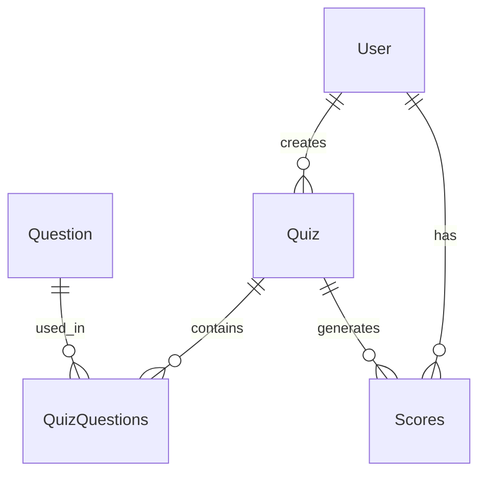

# Decision Helper App: System Design Document

## Architecture Overview

Decision Helper App follows the MVVM (Model-View-ViewModel) architecture pattern to ensure a clear separation of concerns, modularity, and ease of maintenance. The application integrates with Firebase services for authentication, data storage, and file management.

```
┌─────────────┐     ┌───────────────┐     ┌────────────────┐     ┌─────────────┐
│     View    │◄────│   ViewModel   │◄────│   Repository   │◄────│    Model    │
│  Activities │     │ LiveData/Obs. │     │ Data Access/   │     │  Entities   │
│  Fragments  │────►│ Event Handlers│────►│ Business Logic │────►│   & DAOs    │
└─────────────┘     └───────────────┘     └────────────────┘     └─────────────┘
```

## 1. Model Layer

The Model layer represents domain data and business logic.

### 1.1 Data Models

#### 1.1.1 User.java
- **Responsibility**: Represents user information and authentication state
- **Properties**:
  - `id`: String - Unique identifier (Firebase UID)
  - `email`: String - User's email address
  - `name`: String - User's display name
  - `profilePictureUrl`: String - URL to profile image

#### 1.1.2 Quiz.java
- **Responsibility**: Represents a decision quiz/questionnaire
- **Properties**:
  - `id`: String - Unique identifier
  - `customTitle`: String - Quiz title
  - `description`: String - Quiz description
  - `userId`: String - Creator's user ID
  - `score`: int - Score value (if applicable)
  - `isPublic`: boolean - Public availability flag

#### 1.1.3 Question.java
- **Responsibility**: Represents individual questions within quizzes
- **Properties**:
  - `id`: String - Unique identifier
  - `title`: String - Question text
  - `type`: String - Question type (multiple_choice, yes_no_question)
  - `description`: String - Storage for answer options encoded as text
  - `answers`: List<Answer> - Collection of answer options
  - `score`: int - Score value (if applicable)

// להמשיך מכאן
#### 1.1.4 QuizQuestions.java
- **Responsibility**: Maps relationship between quizzes and questions
- **Properties**:
  - `id`: String - Unique identifier
  - `quizId`: String - Associated quiz ID
  - `questionsId`: List<String> - List of question IDs

#### 1.1.5 Scores.java
- **Responsibility**: Records quiz scores and interpretations
- **Properties**:
  - `id`: String - Unique identifier
  - `quizId`: String - Associated quiz ID
  - `userId`: String - User ID
  - `score`: int - Numeric score

### 1.2 Data Access Objects (DAOs)

#### 1.2.1 UserDAO.java
- **Responsibility**: Manages user data in Firebase Firestore
- **Key Methods**:
  - `getUserById(String id, SingleUserCallback callback)`: Fetches user by ID
  - `addUser(User user, ActionCallback callback)`: Creates new user record
  - `updateUser(User user, ActionCallback callback)`: Updates existing user

#### 1.2.2 QuizDAO.java
- **Responsibility**: Manages quiz data in Firebase Firestore
- **Key Methods**:
  - `getAllQuizzes(QuizCallback callback)`: Retrieves all quizzes
  - `getQuizById(String quizId, SingleQuizCallback callback)`: Fetches quiz by ID
  - `addQuiz(Quiz quiz, ActionCallback callback)`: Creates new quiz
  - `deleteQuiz(String quizId, ActionCallback callback)`: Removes quiz

#### 1.2.3 QuestionDAO.java
- **Responsibility**: Manages question data in Firebase Firestore
- **Key Methods**:
  - `addQuestion(Question question, ActionCallback callback)`: Creates new question
  - `deleteQuestion(String id, QuizDAO.ActionCallback callback)`: Removes question

#### 1.2.4 QuizQuestionsDAO.java
- **Responsibility**: Manages quiz-question relationships
- **Key Methods**:
  - `getQuestionsForQuiz(String quizId, QuestionsCallback callback)`: Gets questions for specific quiz
  - `addQuizQuestion(QuizQuestions quizQuestion, String quizID, ActionCallback callback)`: Links question to quiz
  - `deleteQuizQuestions(String quizId, ActionCallback callback)`: Removes quiz-question associations

#### 1.2.5 ScoresDAO.java
- **Responsibility**: Manages score data
- **Key Methods**:
  - `getAllScores(ScoresCallback callback)`: Retrieves all scores
  - `deleteScore(String scoreId, ActionCallback callback)`: Removes score

### 1.3 Repository

#### 1.3.1 DecisionRepository.java
- **Responsibility**: Centralizes data operations from all DAOs
- **Properties**:
  - `questionDAO`: QuestionDAO
  - `quizDAO`: QuizDAO
  - `userDAO`: UserDAO
  - `scoresDAO`: ScoresDAO
  - `quizQuestionsDAO`: QuizQuestionsDAO
- **Key Methods**:
  - User related methods:
    - `getUserById(String userId, UserDAO.SingleUserCallback callback)`
    - `addUser(User user, UserDAO.ActionCallback callback)`
    - `updateUser(User user, UserDAO.ActionCallback callback)`
  - Quiz related methods:
    - `getAllQuizzes(QuizDAO.QuizCallback callback)`
    - `getQuizById(String quizId, QuizDAO.SingleQuizCallback callback)`
    - `addQuiz(Quiz quiz, QuizDAO.ActionCallback callback)`
    - `deleteQuiz(String quizId, QuizDAO.ActionCallback callback)`
  - Question related methods:
    - `addQuestion(Question question, QuestionDAO.ActionCallback callback)`
    - `deleteQuestion(String id, QuizDAO.ActionCallback callback)`
  - QuizQuestions related methods:
    - `getQuestionsForQuiz(String quizId, QuizQuestionsDAO.QuestionsCallback callback)`
    - `addQuizQuestion(QuizQuestions quizQuestion, String quizID, QuizQuestionsDAO.ActionCallback callback)`
    - `deleteQuizQuestions(String quizId, QuizQuestionsDAO.ActionCallback callback)`
  - Scores related methods:
    - `getAllScores(ScoresDAO.ScoresCallback callback)`

## 2. View Layer

The View layer contains UI components and user interaction handlers.

### 2.1 Activities

#### 2.1.1 BaseActivity.java
- **Responsibility**: Parent class for common activity functionality
- **Key Methods**:
  - Basic activity setup and shared behavior

#### 2.1.2 SplashActivity.java
- **Responsibility**: Application entry point and authentication check
- **Key Methods**:
  - Authentication state verification and redirection

#### 2.1.3 LoginActivity.java
- **Responsibility**: Handles user authentication
- **Key Methods**:
  - Email/password login
  - Google Sign-In integration
  - Registration form handling

#### 2.1.4 MainActivity.java
- **Responsibility**: Primary navigation hub
- **Key Methods**:
  - `onCreate()`: Sets up main UI and navigation buttons
  - `navigateToLogin()`: Handles redirection to login
  - `updateUIWithUser()`: Updates UI with user information
  - Navigation to various app sections

#### 2.1.5 CreateQuizActivity.java
- **Responsibility**: Quiz creation interface
- **Key Methods**:
  - Form handling for quiz creation
  - Question management interface
  - Image upload functionality

#### 2.1.6 QuizActivity.java
- **Responsibility**: Quiz listing and management
- **Key Methods**:
  - Display available quizzes
  - Quiz filtering and sorting
  - Quiz deletion
  - Quiz selection for taking

#### 2.1.7 TakeQuizActivity.java
- **Responsibility**: Quiz answering interface
- **Key Methods**:
  - Question display and navigation
  - Answer selection handling
  - Progress tracking
  - Results calculation

#### 2.1.8 ScoresActivity.java
- **Responsibility**: Displays quiz results and scores
- **Key Methods**:
  - Score visualization
  - Historical data display

#### 2.1.9 UserActivity.java
- **Responsibility**: User profile management
- **Key Methods**:
  - `loadUserData()`: Fetches and displays user info
  - `logoutUser()`: Signs out the user
  - `connectWithGmail()`: Links Google account
  - `firebaseAuthWithGoogle()`: Handles Google authentication
  - `redirectToLogin()`: Redirects to login screen

### 2.2 Adapters

#### 2.2.1 QuizAdapter.java
- **Responsibility**: Binds quiz data to RecyclerView
- **Key Methods**:
  - Quiz item display
  - Click handling for quiz selection
  - Delete button handling

#### 2.2.2 QuestionAdapter.java
- **Responsibility**: Manages question display in lists
- **Key Methods**:
  - Question item display
  - Edit/delete operations for questions

#### 2.2.3 ScoresAdapter.java
- **Responsibility**: Handles score data visualization
- **Key Methods**:
  - Score item display
  - Formatting and presentation of score data

## 3. ViewModel Layer

The ViewModel layer processes data for UI and manages UI-related state.

### 3.1 LoginViewModel.java
- **Responsibility**: Manages authentication logic
- **Properties**:
  - `authUseCase`: Handles authentication operations
- **Key Methods**:
  - `login(String email, String password)`: Email/password authentication
  - `register(String name, String email, String password)`: User registration
  - `loginWithGoogle(GoogleSignInAccount account)`: Google authentication
  - LiveData getters for user, error, and loading states

### 3.2 MainViewModel.java
- **Responsibility**: Manages main screen state
- **Properties**:
  - `currentUser`: MutableLiveData<User>
  - `currentUserName`: MutableLiveData<String>
  - `errorMessage`: MutableLiveData<String>
  - `isLoading`: MutableLiveData<Boolean>
- **Key Methods**:
  - `loadUserData(String userId)`: Loads user data by ID
  - LiveData getters for user, error, and loading states

### 3.3 CreateQuizViewModel.java
- **Responsibility**: Manages quiz creation workflow
- **Properties**:
  - `questionsList`: MutableLiveData<List<Question>>
  - `errorMessage`: MutableLiveData<String>
  - `isLoading`: MutableLiveData<Boolean>
  - `quizSaved`: MutableLiveData<Boolean>
- **Key Methods**:
  - `addQuestion()`: Adds question to list
  - `deleteQuestion()`: Removes question from list
  - `uploadImage(Uri)`: Uploads question image to Firebase Storage
  - `saveQuiz(String description, String name, String userId, boolean isPublic)`: Saves quiz to database
  - `validateQuiz(String, String)`: Validates quiz input before saving
  - LiveData getters for questions, errors, loading, and save states

### 3.4 QuizViewModel.java
- **Responsibility**: Controls quiz interaction flow
- **Properties**:
  - `quizStatus`: MutableLiveData<String>
  - `currentQuiz`: MutableLiveData<Quiz>
  - `quizList`: MutableLiveData<List<Quiz>>
  - `questionsList`: MutableLiveData<List<Question>>
  - `currentQuestion`: MutableLiveData<Question>
  - `currentQuestionIndex`: MutableLiveData<Integer>
  - `errorMessage`: MutableLiveData<String>
  - `isLoading`: MutableLiveData<Boolean>
- **Key Methods**:
  - `loadAllQuizzes()`: Loads quiz list
  - `loadQuizById(String quizId)`: Loads specific quiz
  - `loadQuestionsForQuiz(String quizId)`: Loads questions for quiz
  - `deleteQuiz(String quizId)`: Deletes quiz and related data
  - LiveData getters for quiz status, current quiz, quiz list, error messages, and loading state

### 3.5 ScoresViewModel.java
- **Responsibility**: Processes score data
- **Key Methods**:
  - Score data loading
  - Score processing and formatting
  - Data visualization preparation

## 4. Authentication and Security

### 4.1 AuthUseCase.java
- **Responsibility**: Implements authentication logic
- **Properties**:
  - `repository`: DecisionRepository
  - `mAuth`: FirebaseAuth
  - `loggedInUser`: MutableLiveData<User>
  - `errorMessage`: MutableLiveData<String>
  - `isLoading`: MutableLiveData<Boolean>
- **Key Methods**:
  - `login(String email, String password)`: Email authentication
  - `register(String name, String email, String password)`: User registration
  - `loginWithGoogle(GoogleSignInAccount account)`: Google authentication

### 4.2 GoogleSignInHelper.java
- **Responsibility**: Facilitates Google authentication
- **Key Methods**:
  - `launchSignIn()`: Initiates sign-in
  - Google authentication result handling

## 5. Utility Classes

### 5.1 MenuHelper.java
- **Responsibility**: Menu management utilities
- **Key Methods**:
  - Menu creation and display
  - Menu item handling

## 6. Database Schema

### 6.1 Cloud Firestore Collections

```
Users
├── user_id (document)
│   ├── email: String
│   ├── name: String
│   ├── profilePictureUrl: String (optional)
│   └── id: String

Quizzes
├── quiz_id (document)
│   ├── customTitle: String
│   ├── description: String
│   ├── userId: String (ref to Users)
│   ├── isPublic: Boolean
│   └── score: Number

Questions
├── question_id (document)
│   ├── title: String
│   ├── type: String
│   ├── description: String (contains serialized answer options)
│   └── imageUrl: String (optional)

QuizQuestions
├── quizquestion_id (document)
│   ├── quizId: String (ref to Quizzes)
│   └── questionsId: Array<String> (ref to Questions)

Scores
├── score_id (document)
    ├── quizId: String (ref to Quizzes)
    ├── userId: String (ref to Users)
    └── score: Number
```

### 6.2 Local SQLite Database

The application also maintains a local SQLite database for offline caching with the following tables:

```
questions
├── id: INTEGER PRIMARY KEY AUTOINCREMENT
├── question_text: TEXT
└── quiz_name: TEXT

quizzes
├── id: INTEGER PRIMARY KEY AUTOINCREMENT
└── quiz_name: TEXT

results
├── id: INTEGER PRIMARY KEY AUTOINCREMENT
├── quiz_name: TEXT
└── score: INTEGER
```

## 7. Entity Relationships



## 8. System Interactions

### 8.1 Authentication Flow
1. User enters credentials (email/password or Google)
2. AuthUseCase validates credentials with Firebase Auth
3. On success, user data is fetched from Firestore
4. User state is propagated to UI via LiveData
5. Navigation redirects to MainActivity

### 8.2 Quiz Creation Flow
1. User enters quiz details in CreateQuizActivity
2. Data is validated by CreateQuizViewModel
3. Quiz is saved to Firestore via Repository
4. Questions are created and linked to quiz via QuizQuestionsDAO
5. Success/failure state is propagated to UI

### 8.3 Quiz Taking Flow
1. User selects quiz from list
2. QuizViewModel loads questions via Repository
3. User navigates through questions and submits answers
4. Score is calculated based on answer weights
5. Result is saved to Scores collection

## 9. Dependencies

- Firebase Authentication: User authentication
- Cloud Firestore: Database storage
- Firebase Storage: Image storage
- Android Architecture Components (LiveData, ViewModel): UI state management
- Glide: Image loading and caching
- SQLite: Local data caching
